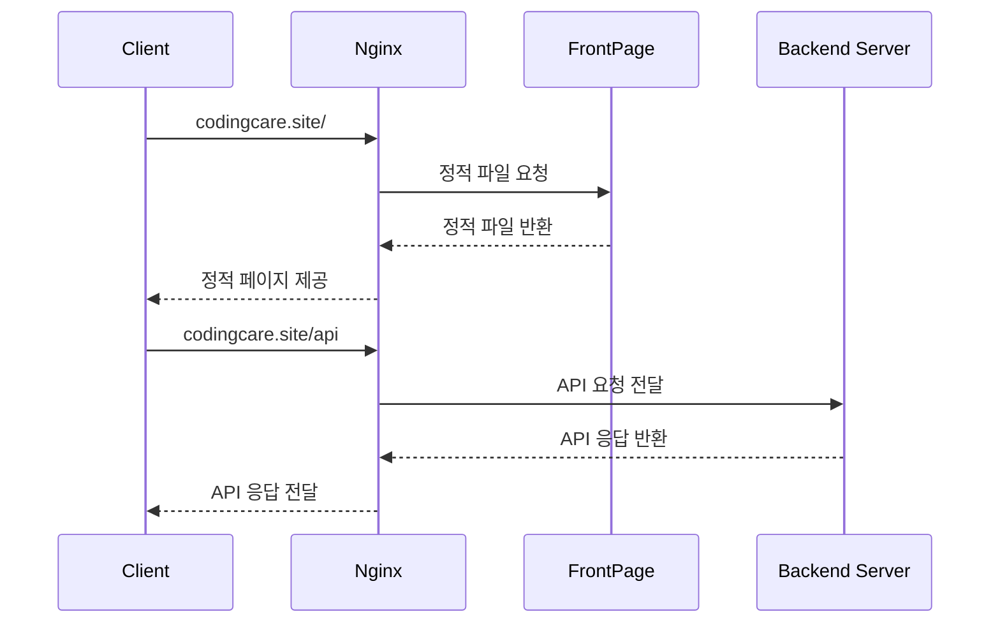
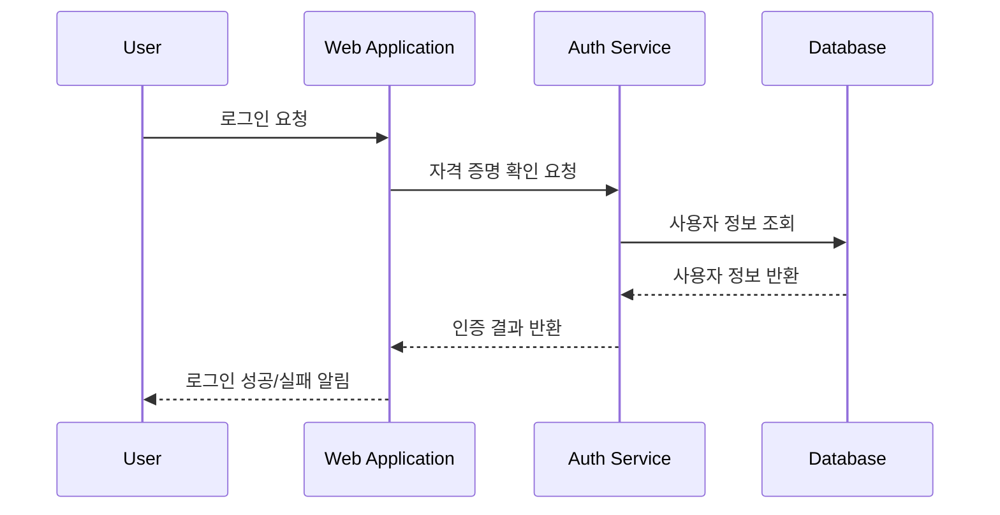

🖼️ 블로그 프로젝트 
===

# 🔗 [배포 링크](https://codingcare.site/)
> Coding Care 배포 링크입니다.
# 📌 [API 명세서](https://codingcare.site/api/swagger-ui/index.html)
> API 명세서 입니다.
# 📊 [협업 공간](https://profuse-aftershave-ac6.notion.site/10dfca5223ab80e893b9fd1cd4729399?v=ffffca5223ab81bf8a14000cd77d0810&pvs=4)
> 노션 협업 공간입니다.

# 💻 프로젝트 정보

## 팀원 소개
<table>
<thead>
<tr>
<th align="center"><strong>박준민</strong></th>
<th align="center"><strong>오은솔</strong></th>
<th align="center"><strong>이효원</strong></th>
<th align="center"><strong>고채린</strong></th>
<th align="center"><strong>김대호</strong></th>
</tr>
</thead>
<tbody>
<tr>
<td align="center"><a href="https://github.com/pjm2571">   @pjm2571</a></td>
<td align="center"><a href="https://github.com/OHEUNSOL">   @OHEUNSOL</a></td>
<td align="center"><a href="https://github.com/ymj07168">   @ymj07168</a></td>
<td align="center"><a href="https://github.com/chaelin2">   @chaelin2</a></td>
<td align="center"><a href="https://github.com/DHowor1d">   @DHowor1d</a></td>
</tr>
</tbody>
</table>

[//]: # ()
[//]: # (# 🛠️ 개발 환경)

[//]: # (## 기술 스택 [Backend])

[//]: # ()
[//]: # (<h2>백엔드 기술 스택</h2>)

[//]: # ()

[//]: # ()

[//]: # ()

[//]: # ()

[//]: # ()

[//]: # ()
[//]: # (<h2>프론트 기술 스택</h2>)

[//]: # ()

[//]: # ()

[//]: # ()

[//]: # ()

[//]: # ()

[//]: # ()
[//]: # ()
[//]: # (<h2>배포 기술 스택</h2>)

[//]: # ()

[//]: # ()

[//]: # ()

[//]: # ()

[//]: # ()
[//]: # (<h2>버전 관리</h2>)

[//]: # ()

[//]: # ( 
)

[//]: # ()
[//]: # (<h2>협업툴</h2>)

[//]: # ()

[//]: # ()

[//]: # ()
[//]: # (<h2>디자인</h2>)

[//]: # ()

# ⌨️ Sequence Diagram

## Nginx Reverse Proxy 흐름도

## Login 인증 Sequence

## 
